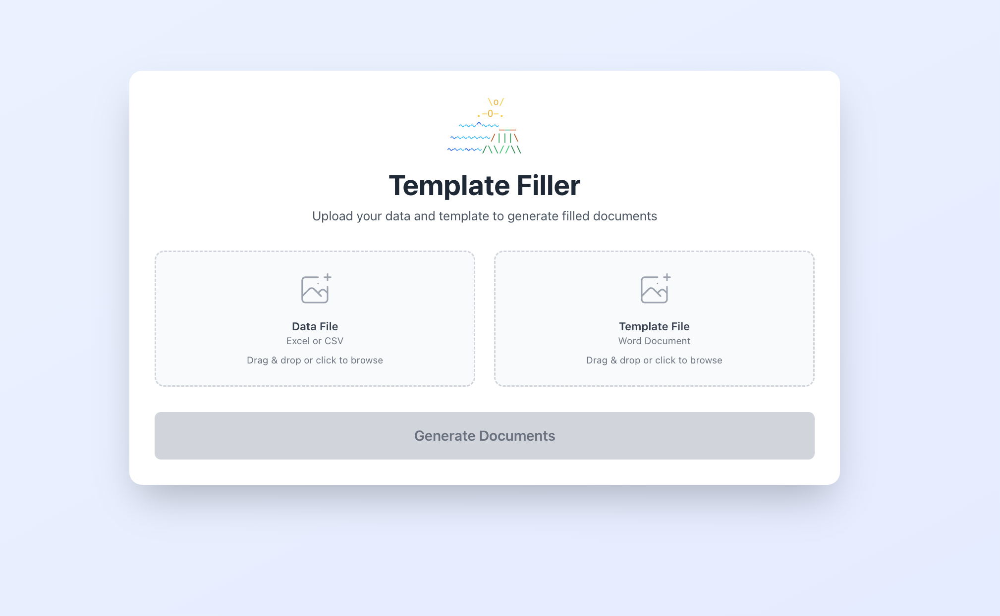

# Template Filler

A minimalistic web application for filling Word document templates with data from Excel or CSV files.



## Features

- 📄 Upload Excel (.xlsx, .xls) or CSV files with data
- 📝 Upload Word document templates with placeholders
- 🔄 Automatically generate filled documents for each data row
- 📦 Download all generated documents as a zip file
- 🎨 Modern, intuitive drag-and-drop interface

## Architecture

- **Backend**: FastAPI (Python 3.13)
- **Frontend**: React + TypeScript + Tailwind CSS
- **Communication**: Single REST endpoint for minimal data transfer

## Installation

### Backend

Requires Python 3.13.

```bash
# Install dependencies
python3.13 -m pip install python-docx openpyxl fastapi uvicorn python-multipart

# Or install from pyproject.toml
pip install -e .
```

### Frontend

Requires Node.js.

```bash
cd frontend
npm install
```

## Usage

### Start the Backend

From the project root:

```bash
python3.13 -m uvicorn template_filler.api:app --reload
```

The API will be available at `http://localhost:8000`.

### Start the Frontend

From the `frontend` directory:

```bash
npm run dev
```

The web interface will be available at `http://localhost:5173`.

### Share Your App with Others Over the Internet

To make your locally running app accessible to others over the internet:

1. **Start your app locally** (both backend and frontend as described above)

2. **Install localtunnel** (if not already installed):
   ```bash
   npm install -g localtunnel
   ```

3. **Expose your frontend** via localtunnel:
   ```bash
   npx localtunnel --port 5173
   ```

4. **Share the URL** that appears (e.g., `https://your-subdomain.loca.lt`)

**Note**:
- First-time visitors will see a localtunnel warning page - they just need to click "Continue"
- The tunnel URL changes each time you restart localtunnel
- This is safe for development/sharing with friends, but not for production use
- Only run the tunnel when needed and stop it when done

**Alternative: ngrok** (requires free account):
```bash
# Install
brew install ngrok

# Sign up at https://dashboard.ngrok.com/signup
# Add your authtoken
ngrok config add-authtoken YOUR_TOKEN

# Start tunnel
ngrok http 5173 --basic-auth "username:password"
```

### Using the Application

1. Open `http://localhost:5173` in your browser
2. Upload your data file (Excel or CSV)
3. Upload your Word template file with placeholders in the format `{column_name}`
4. Click "Generate Documents"
5. Download the zip file containing all filled documents

## Data File Format

Your Excel or CSV file should have:
- **First row**: Column headers (used as placeholder names)
- **Second row**: Verbose placeholder descriptions (skipped during processing)
- **Remaining rows**: Actual data to fill into templates
- **First column**: Label column (skipped during processing)

## Template Format

Word templates should use placeholders in the format `{column_name}` where `column_name` matches a header from your data file.

Example:
```
Dear {name},

Your order number {order_id} has been confirmed.
```

## API Documentation

### `POST /fill-templates`

Upload data and template files to generate filled documents.

**Parameters**:
- `data_file`: Excel or CSV file (form-data)
- `template_file`: Word template file (form-data)

**Returns**: ZIP file containing all generated documents

### `GET /health`

Health check endpoint.

**Returns**: `{"status": "ok"}`

## Development

### Run Linting

```bash
ruff check template_filler/
```

### Run Tests

```bash
pytest
```

## License

Proprietary
